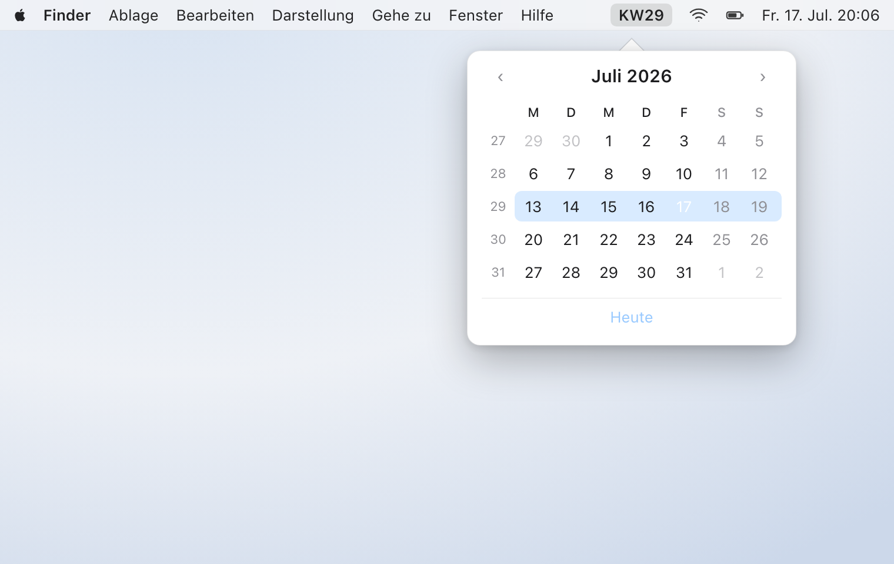

<p align="center">
  
</p>

# QuickWeek

[](https://github.com/marsvogel/QuickWeek/actions/workflows/build.yml)
[](https://github.com/marsvogel/QuickWeek/releases/latest)
[](#requirements)
[](LICENSE)
[](https://deepwiki.com/marsvogel/QuickWeek)
[](./AI_DISCLOSURE.md)

A macOS menu bar app that shows the current **ISO-8601 calendar week** — the German *Kalenderwoche* (KW) — right where you already look.

macOS shows the date and time everywhere but never the week number, even though much of Europe schedules by it (“let’s ship in KW32”). QuickWeek puts it in your menu bar and one click away.

<p align="center">
  <picture>
    <source media="(prefers-color-scheme: dark)" srcset="docs/hero-dark.png">
    
  </picture>
</p>

## Requirements

- macOS 14 (Sonoma) or later

## Installation

1. Download `QuickWeek.zip` from the [latest release](../../releases/latest), unzip it, and move `QuickWeek.app` to *Applications*.
2. QuickWeek is ad-hoc signed but **not notarized** (there’s no paid Apple Developer account behind it), so Gatekeeper blocks the first launch. On macOS Sequoia (15) and later, the old “right-click → Open” shortcut is gone. To open it:
   - Double-click `QuickWeek.app`; macOS blocks it — click *Done*.
   - Open **System Settings ▸ Privacy & Security**, scroll to the bottom, and click **Open Anyway**, then confirm.
     *(In German: Systemeinstellungen ▸ Datenschutz & Sicherheit ▸ Trotzdem öffnen.)*

   Prefer the Terminal? Remove the quarantine flag instead:

   ```sh
   xattr -dr com.apple.quarantine /Applications/QuickWeek.app
   ```

If you’d rather not run software that isn’t notarized, [build it from source](#building-from-source) in a few seconds.

## Usage

After launch, the current week — e.g. **KW29** — appears in the menu bar. There is no Dock icon and no window.

- **Left-click** the menu-bar item to open a month calendar. Every row shows its week number; the current week is tinted and today is circled. **Heute** jumps back to the current month.
- **Right-click** for a small menu (Quit / *Beenden*).
- The number refreshes automatically at midnight and when your Mac wakes from sleep.

Weeks follow **ISO-8601**: they start on Monday, and week 1 is the week containing the year’s first Thursday — the same counting used for the *Kalenderwoche*.

## Privacy & trust

QuickWeek reads only your Mac’s current date. There is **no network access, no data collection, no analytics, and no third-party code** — the whole app is a few files of Swift you can read in a minute, and it runs in the App Sandbox.

Because the app isn’t notarized, the project makes the build verifiable rather than asking you to trust a signature:

- Read the source and [build it yourself](#building-from-source).
- Verify a release’s build provenance:

  ```sh
  gh attestation verify QuickWeek.zip -R marsvogel/QuickWeek
  ```

- Or check the SHA-256 checksum published with each release.

## Building from source

Requires a recent Xcode:

```sh
xcodebuild -project QuickWeek.xcodeproj -target QuickWeek -configuration Release build
```

The app lands in `build/Release/QuickWeek.app`. Run the tests with:

```sh
xcodebuild test -project QuickWeek.xcodeproj -scheme QuickWeek
```

## Contributing

See [CONTRIBUTING.md](CONTRIBUTING.md). Security issues: see [SECURITY.md](SECURITY.md).

The interface is German today — an **English localization is a welcome first contribution** (see [good first issues](https://github.com/marsvogel/QuickWeek/labels/good%20first%20issue)).

## About the name

*QuickWeek* is exactly what it does: a quick glance at the menu bar tells you the week. No calendar, no counting — the *Kalenderwoche*, always in sight.

## License

[MIT](LICENSE)
